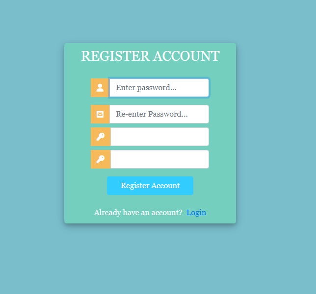
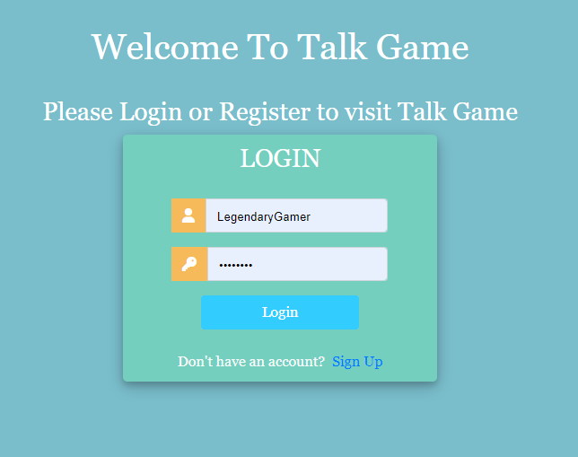
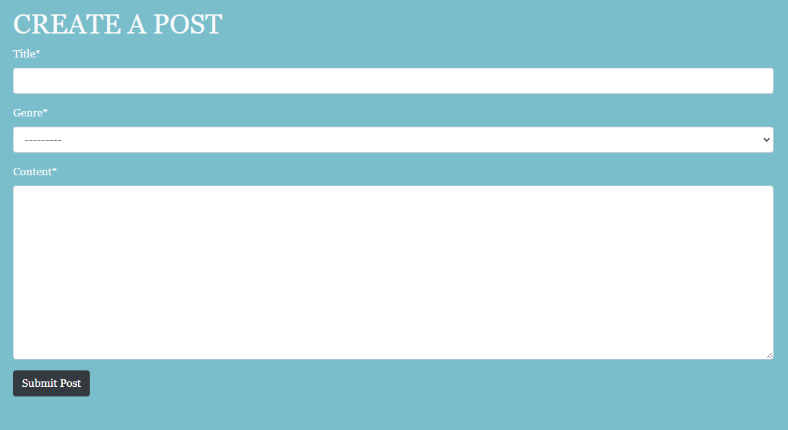

#                                                        **Talk Game**

Talk game is a forum in which profiles can be created to allow users full access to public
reviews of a range of gaming genres. Registered users can not only view posts, but create their own
and be part of the discussion through the commenting and likes system.

The target audience for Talk Game is Gamers of all kinds from Veterans to brand new noobs that are
looking to find a new game to play, and heighten their knowledge of their current games. While also
helping and guiding others through the ever expanding universe that is gaming.

## Features

- A fully functioning and responsive navigation bar that allows users to search through posts or select a specific genre to view.

- Registration form which allows users to create their own account to be able to gain full access to the website.

- Login page, once users have registered an account they will be taken to the login page, so they can sign in and enjoy all that
Talk Game has to offer.

- Creating a post, Registered users will be able to create their own posts for all other visitors and users to see and interact with.

- A footer with links to all social media platforms and also displays the copyright for the website.

Inspiration

Log in and Registration forms - Dennis Ivy https://www.youtube.com/watch?v=tUqUdu0Sjyc