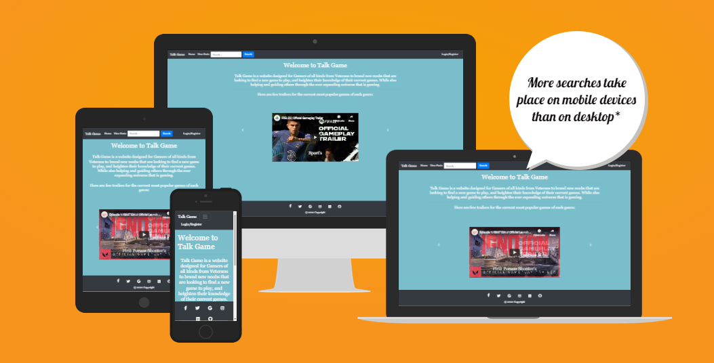
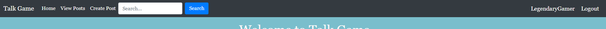

#                                                        **Talk Game**

Talk game is a forum in which profiles can be created to allow users full access to public
reviews of a range of gaming genres. Registered users can not only view posts, but create their own
and be part of the discussion through the commenting and likes system.

The target audience for Talk Game is Gamers of all kinds from Veterans to brand new noobs that are
looking to find a new game to play, and heighten their knowledge of their current games. While also
helping and guiding others through the ever expanding universe that is gaming.

## Features

- A fully functioning and responsive navigation bar that allows users to search through posts or select a specific genre to view.

- Registration form which allows users to create their own account to be able to gain full access to the website.

- Login page, once users have registered an account they will be taken to the login page, so they can sign in and enjoy all that
Talk Game has to offer.

- Creating a post, Registered users will be able to create their own posts for all other visitors and users to see and interact with.

- A footer with links to all social media platforms and also displays the copyright for the website.

# Unfinished Goals

Unfortunately many things I would have liked to have done in this project didn't get done, Due to various issues and commitments
I haven't had the time I would of liked to dedicate to this project

- Comments, Created the comment Model but I could not get them intergrated with my application

- Likes, unfortunately also ran out of time before I could apply likes to my web application

- Search Bar, I got the search bar very close to working. Kept running into multiple errors and eventually ran out of time.

# Testing

Ran tests in my application for some of my views and forms

- Views Testing

- Forms Testing

## Validators User

- W3C Markup Validator

- W3C CSS Validator

- PEP8 Python checker

## Manual Testing on smaller screen sizes and other browsers
- The page was tested on all popular browsers and on all screen sizes.

# User Experience

- As a site visitor, I want to register/login with username/password to become a user, so that I can access all parts of the website.
- As a site visitor/user, I want to be constantly aware of my login status.
- As a site user I want to be able to Create, Edit and Delete my own personal posts
- As a site visitor/user I want to be able to view all posts that are on the website
- As a admin/superuser I want to be able to view, edit, delete all posts on the website(not currently available)

# Agile

For this project the GitHub Kanban agile project management tool was used to create EPICs, add User Stories to these EPICs and give each user story relevant tasks.
I did not utilize this tool to its full potential throughout this project. As I was left with very limited time to actually work on my PP4, I found myself rushing.
However when I did use this Agili tool I did find it very helpful in keeping me on the tasks at hand and keeping organized.

# Languages used

- HTML5

- CSS

- JavaScript

- Python

- Bootstrap

- GitPod was used as a virtual IDE workspace to build this site.

## Version Control
### Git
- Git was used for version control by utilizing the Gitpod terminal to add and commit to Git and push to GitHub.

### GitHub
- GitHub is used to store the code for this project after being pushed from Git.

## Site Design
### Font Awesome
- Font Awesome was used on the page to add icons.

### Google Fonts
- Google Fonts was used to import an appropriate font for the site.

### Bootstrap (4.6)
- Bootstrap was used for styling and responsiveness.

## Development
### Django
- Django was used as the framework to build this project.

### Django Crispy Forms
- Django Crispy Forms was used to give all forms in the project an imrpoved styling.

## Hosting/Database
### Heroku
- Heroku is used to host the application.

### Gunicorn
- Gunicorn is used for deploying the project to Heroku.

### Cloudinary
- Cloudinary is used to host the static and media files and serve them to Heroku.

### PostgreSQL
- PostgreSQL is used as the database.

# Credits

- Log in and Registration forms inspired by Dennis Ivy https://www.youtube.com/watch?v=tUqUdu0Sjyc

- Lots of helpful Tips and tricks from codemy.com's Django blog youtube series: https://www.youtube.com/watch?v=B40bteAMM_M&list=PLCC34OHNcOtr025c1kHSPrnP18YPB-NFi

- A massive thanks to the Code Institute tutors for helping me through some very tough situations.

- My Tutor Antonio Rodriguez

- A project from one of Antonio Rodriguez old students - https://github.com/TimSchulz1991